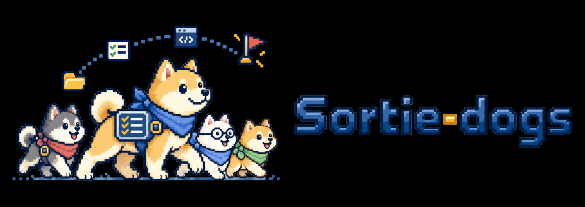

# Sortie-dogs

<p align="center">
  
</p>

**A goal-preserving, adaptive execution harness for OpenCode that optimizes cost,
time, and proof without taking your setup over.**

Use OpenCode normally. Invoke Sortie only when you want scoped investigation,
implementation, validation, review, and model routing.

- **Goal invariance**: accepted outcomes and proof requirements survive delegation,
  continuation, remediation, and restart.
- **Adaptive execution**: small work stays small; additional agents and stronger
  models are used only when task shape or risk justifies them.
- **Clear Worker instructions**: give Luna a concise goal, explicit constraints
  and completion criteria; keep orchestration bookkeeping in the harness.
  See the [instruction design principles](docs/worker-instruction-design.md).
- **Coexistence**: Sortie activates only when selected and preserves normal
  OpenCode agents, settings, and user-owned files.
- **Cost, time, and proof**: the objective is a verified result at the lowest
  practical cost and wall time, not the largest agent count.

[](https://github.com/zufall-upon/Sortie-dogs/releases/latest)
[](https://www.npmjs.com/package/sortie-dogs)
[](https://github.com/zufall-upon/Sortie-dogs/actions/workflows/test.yml)
[](https://opencode.ai/)
[](https://www.typescriptlang.org/)
[](https://www.npmjs.com/package/sortie-dogs)
[](LICENSE)


Guides: [日本語](docs/guide-ja.md) · [简体中文](docs/guide-zh-CN.md) ·
[Testing](docs/testing.md) · [CLI testing](docs/cli-testing.md)

**Current release: [v0.13.7](https://github.com/zufall-upon/Sortie-dogs/releases/tag/v0.13.7)**
([release notes](docs/release-v0.13.7.md)). The default Mission runtime retains the `v010`
profile, command and configuration names for compatibility; these names do not mean v0.10 is installed.
The current asset marker is `0.13.7-review-recovery-v1`.

## SWE-bench Lite: 170/300 (56.67%)

The fixed **Sortie-dogs v0.12.24** harness resolved **170 of 300 SWE-bench Lite test issues** in one pass@1 campaign, with 9 empty patches and no official evaluation errors. Every instance has a frozen prediction and an inference-time trajectory. The task Workers ran `openai/gpt-6-luna-fast#max`; operator, coordinator and review roles ran `openai/gpt-6-sol#xhigh`. This is a system result, **not** a Luna-only model comparison or a Verified/full SWE-bench score.

[Technical report and per-repository results](docs/benchmarks/swebench-lite-v01224-test300-2026-09-29.md) · [Public predictions, logs and trajectories](https://github.com/zufall-upon/sortie-dogs-swebench-lite-20260929)

The single official 300-instance report and frozen predictions are hash-bound in the report. Confirmed inference expense was **$162.99**; a separate **$34.60** of usage has unknown pricing and is held against the campaign cap, **not** counted as known expense. Leaderboard registration and maintainer acceptance are separate from this official local evaluation.

Historical scores below belong to their fixed candidates, not v0.13.7. SWE-bench is a separate,
optional measurement rather than a mandatory release gate.

> **Beta:** v0.13.x is still stabilizing. Runtime behavior,
> configuration, and generated assets may still change before 1.0.

## Quick start

Requirements: Node.js 22.6 or newer, npm, and OpenCode V2.

Run these commands in the target project:

```sh
npm install --save-dev sortie-dogs@latest
npx sortie-dogs init .
```

`init` defaults to the `v010` Mission profile and registers the OpenCode V2 plugin in
`.opencode/opencode.json(c)`, preserving unrelated settings. It sets subagent depth to at least two:

```json
{
  "plugins": ["sortie-dogs"],
  "experimental": { "subagent_depth": 2 }
}
```

If an existing local bridge already imports `sortie-dogs/server`, `init` reuses it instead of adding
a duplicate package entry. A larger existing subagent depth is retained.

Completely restart OpenCode, then run:

```text
/sortie-v010 <task>
```

Selecting `dog-operator` directly starts the same workflow. `dog-operator` is the
user-facing entry point for the Mission profile. `dogs-coordinator` and every `*-v010` role are
internal children and must not be selected as task entry points.

`init` installs runtime assets and merges the required OpenCode settings; the package entry or
existing local bridge loads enforcement and model routing. OpenCode can reload watched configuration,
but replacing an installed dependency may require a full restart. A new chat session alone does not
prove the newly installed plugin is loaded.

## v0.13.7 runtime updates

PRs #158/#159 prevent late write-only reports from falsely invalidating bound non-generating
native checks, while preserving actual source/output freshness, failed checks and legacy recipes.
Whole-root grants without a concrete inventory keep full-candidate freshness. Non-Git Mission roots
can prepare independent Review from declared nested repositories/worktrees/plain outputs, including
committed content; corrupt Git/HEAD errors remain visible. Operator performs authorized local recovery
in the same turn without another approval, changed requirements or reset spending. Ubuntu's Git
filesystem-boundary diagnostic is recognized alongside the standard non-repository error.
The PR native observation reached Reviewer startup, not final acceptance. Release receipts:
`_testenv/releases/0.13.7/`; see [release notes](docs/release-v0.13.7.md).

## v0.13.6 runtime updates (retained)

PR #156 references recorded formal PASS evidence in acceptance summaries instead of fetching
the same successful unit's native history again for display. Missing/failed proof retains history
diagnostics; historical evidence is not current freshness or acceptance. Identical external artifact
inventories are shared only inside one snapshot refresh, never across later calls. Operator guidance
proceeds to acceptance when current evidence covers the request and no concrete gap remains.
Existing freshness/review guards, provider/model selection and cache-prefix machinery remain unchanged.
No end-to-end speedup or live token/cache-hit improvement was measured. Release receipts:
`_testenv/releases/0.13.6/`; see [release notes](docs/release-v0.13.6.md).

## v0.13.5 runtime updates (retained)

PR #154 preserves stable model instructions and appends changed host state at native history
boundaries, with complete current-state reconstruction after compaction. Genuine Reviewer tools
have deterministic read-only-first ordering; the real correction-permission transition still remains.
The final candidate restores v3 behavioral review and combined assignment/findings while retaining
exact instruction discovery, inherited Reviewer formal-command delivery, literal local shell-file
scope reconciliation and explicit repository-root read/write scope support. New whole-project
captures avoid bookkeeping-only invalidation; legacy evidence and real source/artifact freshness remain.

The final pre-release cycle 11 Anko sample passed official local score 1 and selected public probes 9/9
in 26m1.866s at estimated $1.41968316. It was faster but 15.762% costlier than the earlier v3 sample,
not combined cost-preserving optimization or a general quality/speed guarantee. Release receipts:
`_testenv/releases/0.13.5/`. See [release notes](docs/release-v0.13.5.md) and
[candidate tradeoffs/failures](docs/cache-prefix-loop-20261003.md). Native Worker startup is not completion.

## v0.13.4 runtime updates (retained)

PR #152 restores same-session Coordinator/Operator implementation and formal validation through
`plan_units(executor="self")`, `start_direct_unit` and `finish_direct_unit`. Known single-unit work can
combine Mission start and planning; Luna Fast/max Worker routing remains the default. Full generated
contracts remain visible when an explicit Read line range covers the file. Native background
responsiveness remains: a launch acknowledgement or idle root is not Mission completion.

The initial independent Reviewer can investigate, correct, formally validate, deliver and self-recheck
continuously in its original native Task. Later Major/Medium findings accumulate in that same correction
context. Author self-recheck remains `self-rechecked`, `independent=false`, never independent `PASS`.
A different Reviewer is conditional on concrete residual Major risk; unresolved Major/Medium findings
still block acceptance. Operator owns final comparison and receipt.

Inherited compiler scratch no longer falsely invalidates broad-scope formal proof. Host-observed Git
delivery, caller-setting review and test-composition guidance reduce avoidable detours. Saved host
completion cards remain in tool history/UI, while outgoing V2 model/compaction context omits only their
presentation body, retaining receipt and evidence identities.

Two runs of the same fixed pre-release v8 package completed the original Anko task with official local
score 1 (F2P 9/9, P2P 94/94) and selected public probes 9/9. Times were 26m49s and 25m55s, costs
$1.47908048 and $1.54610816; each saved more than seven minutes versus the recorded v5 sample.
These limited same-task observations do not establish general speedup or a new SWE-bench score.
Release preflight, full tests, fixed-commit Windows CI and native Worker-start receipts are retained in
`_testenv/releases/0.13.4/`; startup/model identity is not task completion. See the
[release notes](docs/release-v0.13.4.md) and [quality-loop evidence](docs/nightly-quality-loop-20261002.md).

## Mission workflow

Use Operator → Worker when one useful unit and its meaningful formal check are known;
use Operator → Coordinator → Worker for actual discovery or decomposition:

- `dog-operator` states a few requirements/negative constraints and owns user decisions and final acceptance.
  The host saves the original user message verbatim.
- Hidden `dogs-coordinator` owns investigation, unit declarations, Worker/Scout/Advisor/Reviewer dispatch,
  in-request write-scope extensions, and corrections. It can read/search and run confirmation shell commands;
  it can implement and formally validate directly in its own session, or delegate a unit to Worker.
- `dog-worker-v010` implements a host-generated unit within its file/directory write scopes.
  Investigation commands need no pre-registration; formal checks retain real host-recorded results.
- High-risk changes require an initial independent Reviewer with read/search access. Low-risk skips
  are explicit and recorded. Reviewer-owned corrections follow the self-recheck policy above.
- Fast-lane can include high-risk single-unit work; it never implies a review skip.
- Investigation, edits, formal checks and requested Git delivery stay in the same implementing child.
  Explicit user ordering is retained; no routine plan-approval or commit-only handoff is needed.
- Unit progress appears on the running Task without stopping Coordinator or prompting Operator.

The `v010` Mission profile is serial by design; background responsiveness does not add parallel writers.
The stable profile's Luna fabric and parallel integration path are not exposed in this profile. More agents are not a
goal; preserving quality while reducing unnecessary expensive work is.

### SWE-bench evaluation

Official SWE-bench Lite `dev` results on the same 23 public instances:

| Candidate / benchmark adapter | Official resolved | Empty patches | Run conditions | Details |
| --- | ---: | ---: | --- | --- |
| v0.10.6 candidate (`859c396`) | 4 / 23 (17.4%) | 5 | Four inference slots | [Handoff](docs/swebench-handoff-2026-09-21.md) |
| Frozen v0.10.14 build | 6 / 23 (26.1%) | — | Four slots; $1.50/task | [Per-task results](docs/benchmark-v0.10.14-dev23.md) |
| v0.12.8 (`e0f8cef` adapter) | 5 / 23 (21.7%) | 9 | Four slots; budget amended across two batches; 30-minute timeout | [Campaign](docs/swebench-v0128-dev23-2026-09-26.md) |
| v0.12.8 (`84ccdf1` main adapter) | 6 / 23 (26.1%) | 2 | Fresh 23-task run; four slots; 30-minute timeout | [Main-integrated run](docs/swebench-main-84ccdf1-dev23-2026-09-26.md) |
| v0.12.15 (`0c9690d`) | 5 / 23 (21.7%) | 3 | Fresh 23-task ext4 retry; four slots; 40-minute timeout | [Campaign](docs/swebench-v01215-dev23-2026-09-27.md) |
| v0.12.16 (`9b05a34` release; `b1a6c0e` runner) | 4 / 23 (17.4%) | 5 | Fresh 23-task run; eight slots; 40-minute timeout | [Campaign](docs/swebench-v01216-dev23-2026-09-27.md) |
| v0.12.19 (`24f5386` release; matched rerun) | 8 / 23 (34.8%) | 0 | Eight slots; effective $2/instance; 40-minute timeout; one inference timeout | [Official result and provenance](docs/benchmarks/swebench-v01220-operation-observability-2026-09-28.md) |
| v0.12.20 (`628eb81` release) | 7 / 23 (30.4%) | 0 | Eight slots; effective $2/instance; 40-minute timeout | [Official result and caveat](docs/benchmarks/swebench-v01220-operation-observability-2026-09-28.md) |
| v0.12.25 (`49eb1e4` release) | 7 / 23 (30.4%) | 0 | Eight slots; $2/instance; $30 total cap; 20-minute progress check / 40-minute hard maximum | [Comparison baseline](#v0131-dev23-2026-09-30) |
| v0.13.1 (`d19e8be` release; 2026-09-30) | **8 / 23 (34.8%)** | 0 | Eight slots; $2/instance; $46 total cap; 20-minute progress check / 40-minute hard maximum; GPT-6.1 Sol + Luna Fast | [Run summary](#v0131-dev23-2026-09-30) |

Every row has 23 submitted official predictions; an empty patch counts against
the score, not as a missing evaluation. The v0.10.14 report does not separately
summarize empty patches. The v0.12.15 row is the separately approved fresh
run after an initial `/tmp` quota failure, not an additional score for that
failed attempt. Inference completion is **not** official resolution.
Budgets, runtime/adapter versions, and execution conditions changed between
campaigns, so this table is a history of observed results, not a controlled
head-to-head comparison or a general success-rate claim. The v0.10.14 run
estimated $15.75 in model cost and a 15.2-minute median agent runtime.
The v0.12.16 run is the first eight-slot inference score in this table;
five runners timed out, and this does not establish a model-quality regression
against runs with different concurrency and conditions.
The v0.12.19 row is the corrected run with an effective $2 per-instance cap;
an earlier v0.12.19 run scored 7/23 but had no effective per-instance cap and
is not a same-condition comparison. The v0.12.20 run lost the
`sqlfluff__sqlfluff-2419` resolution relative to the corrected run; this
single run-to-run difference does not establish causation.

Historical qualification references remain in [benchmark reference](docs/benchmark-reference.md).

#### v0.13.1 dev23 (2026-09-30)

One fresh pass@1 run and one official SWE-bench harness evaluation resolved
**8/23**, versus **7/23** for v0.12.25. The new resolution was
`pylint-dev__astroid-1333`; all seven previously resolved IDs were retained.
Resolved by repository: marshmallow **2/2**, pvlib **0/5**, pydicom **2/5**,
astroid **3/5**, pyvista **0/1**, sqlfluff **1/5**.

- The scored row is the user-requested fresh run after a host restart. The
  interrupted initial run is excluded from this score; the fresh run made one
  attempt per instance with no inference retry.
- The dataset revision (`6ec7bb89b9342f664a54a6e0a6ea6501d3437cc2`), public rows,
  and all 23 official evaluation image IDs match the v0.12.25 run. Both used
  `official-image-testbed` and sequential official scoring.
- Operator/Coordinator/Reviewer/Advisor defaults changed to
  `openai/gpt-6.1-sol#xhigh`. Actual task Workers remained
  `openai/gpt-6-luna-fast#max`, observed across all 23 instances. The harness and
  total budget also changed, so the extra resolution cannot be attributed to
  the model change alone.
- Inference ended with 20 normal completions, two timeouts
  (`pvlib__pvlib-python-1154`, `sqlfluff__sqlfluff-1763`) and one agent failure
  (`pvlib__pvlib-python-1854`). All patches, including stopped attempts, were
  officially scored: 23 completed evaluations, zero empty patches and zero
  official evaluation errors or infrastructure failures.
- Known estimated inference cost: **$17.73**; separate unknown-usage hold:
  **$1.98**, not counted as known expense. Inference wall time was about
  **81 minutes**, followed by **7.2 minutes** of official scoring.
- Fixed release commit: `d19e8be0d21180cc23ad2ae4b853d846a18e77bc`;
  package SHA-256: `99300ceec0c3eee4fa1f984fed50d15d58b2ff4455df0041850ecd63514b0a51`.
  OpenCode **2.0.20**, official harness **5.0.2**. Local evidence is retained in
  `_testenv/swebench-v0131-dev23-20260930-r2/result-summary.json`; generated
  predictions, databases and raw logs are not committed.

## Mission tools

1. `start_mission`: Operator supplies concise requirements; the host saves original messages. A known single unit
   can include `unit` to combine start/planning and return its configured Worker task.
2. `plan_units`: Operator or Coordinator supplies title, objective, file/directory scopes and formal checks. The host generates
   IDs, handoff, manifest, proof mapping and the ready Worker task. `executor="self"` keeps execution in the
   same controller session; `start_direct_unit` / `finish_direct_unit` retain observed formal-check freshness.
3. `operator_next`: advance serial units. `expand_unit` reconciles required in-request outputs while
   preserving the same Task. A reasoned `plan_units` correction or `retry_mission_unit` handles ordinary
   unit recovery under the original requirements and cumulative budget.
4. `review_mission`: generate the independent review packet from source, requirements and observed checks;
   dispatch its Reviewer task for high-risk changes or record a low-risk skip.
5. `repair_review`: record findings and continue correction in the running original Reviewer Task, or resume
   that same native session. Later findings accumulate; run inherited checks/requested Git delivery and
   explicitly report `SELF_RECHECKED` in that same Task. Legacy
   `CORRECTION_READY` alone requires a same-author read-only fallback through `review_mission`.
6. `submit_mission`: Coordinator returns a completion candidate, user-only decision, or proven external/scope/budget blocker.
7. `complete_mission`: Operator compares the original request, source and evidence, then explicitly accepts.
   Only a succeeded receipt authorizes DONE and the measured 🐾 return report.

All tool names use the `sortie_v010_` prefix. Prior proposal/plan-repair tools remain in the compatibility
implementation but are hidden from the normal Mission tool list. Operator/Coordinator handle in-request
path reconciliation without a new user approval. Changes beyond the original requirements or cumulative
budget return to Operator/user. `EVIDENCE_GAPS` is an advisory limitation, not Review `PASS` or an
automatic extra review; failed or missing required checks still prevent acceptance.

Durable profile state and hash-bound task references support restart and
compaction recovery without reconstructing criteria from summary prose. Stale,
foreign-root, or changed references are rejected. Requested `git add <paths>` and `git commit -m ...`
use the actual source write scope, not a fabricated `.git/**` scope. An optional host-managed Git
lifecycle also retains its branch, commit and post-commit boundaries. Neither mode grants arbitrary
Git, force push, release or publication authority.

### Progress and acceptance evidence

`sortie_v010_operator_status` keeps original requests, formal command/exit/timing observations,
review disposition and recorded delivery in a compact Mission view. `{ "view": "progress" }` exposes
the current unit, completed/total units, host budget and next action; `{ "view": "full" }` or
`details_ref` provides full snapshot diagnostics. Unknown clean state or a failed commit is not delivery
success. Reading progress does not dispatch, retry or accept work; use native completion notifications
instead of polling. Existing status reconciliation can recover a missed child terminal event.

## Configuration

### Profile files and precedence

The default package entry is the `v010` Mission profile:

- Command: `/sortie-v010`
- Primary agent: `dog-operator`
- Project settings: `.opencode/sortie-dogs-v010.json`
- Global settings: `~/.config/opencode/sortie-dogs-v010.json`
- JSON environment override: `SORTIE_DOGS_V010_CONFIG`
- Runtime state: `.sortie-dogs-v010/`
- Installed asset marker: `.opencode/sortie-dogs-v010.version`

For a global install, the marker is `<OpenCode config root>/sortie-dogs-v010.version`.

Precedence is built-in defaults, global file, project file, environment JSON,
then plugin factory options. Unknown properties or invalid types are rejected.
Use external `v010` role names such as `dog-operator`, `dogs-coordinator`, and
`dog-reviewer-v010` in `modelRouting`; do not also declare their stable aliases.

Example `.opencode/sortie-dogs-v010.json`:

```json
{
  "validationProfile": "balanced",
  "readOnlyTools": ["my_mcp_search"],
  "freeTierFallbackModels": ["opencode/deepseek-v4-flash-free"],
  "modelRouting": {
    "dog-operator": {
      "preferred": { "model": "provider/model", "variant": "high" }
    },
    "dogs-coordinator": {
      "preferred": { "model": "provider/model", "variant": "deep" }
    }
  },
  "modelCatalog": {
    "project": [
      { "model": "provider/model", "variants": ["high", "deep"] }
    ]
  },
  "continuation": {
    "enabled": true,
    "taskWatchdogMilliseconds": 300000
  }
}
```

Declare only models and named variants the host actually provides. Sortie does
not invent, probe, or translate variant names.

### Settings reference

- `readOnlyTools`: additional host-specific tools known not to mutate project
  files. Values accumulate across configuration layers. Unknown tools are denied
  in a bound worker session.
- `modelRouting`: preferred and ordered fallback targets by external profile role.
- `modelCatalog`: available `project` and `global` model/variant declarations.
- `freeTierFallbackModels`: ordered global last-resort model IDs. Default:
  `opencode/deepseek-v4-flash-free`; `[]` disables this fallback.
- `dedicatedWorkerModel`: canonical stable serial target, default
  `openai/gpt-6.1-sol` / `medium`. The Mission profile supplies its explicit
  role routes below; do not infer its Worker route from this stable setting.
- `consultation.strategy`: fixed advisor identity, optional `required`, and
  positive `maxCallsPerCandidate`; default one call and not required.
- `consultation.sourceReview`: risk-based review with `maxCallsPerCandidate`
  default `1` and `maxArtifactBytes` default/maximum `30720`. Unavailable review
  blocks only when review is required.
- `continuation.enabled`: default `true`.
- Automatic continuation has no turn-count ceiling. The legacy positive-integer
  `continuation.maxAutoContinues` setting is accepted but ignored.
- `continuation.taskWatchdogMilliseconds`: root inactivity while an implementation
  Task is outstanding; default `300000`, valid range `10..1800000`.
- `continuation.summarizeModel`: optional explicit compaction model; omission
  reuses the latest observed root model.
- `validationProfile`: `fast`, `balanced`, or `assurance`; default `balanced`.
- `reflection`: enabled by default for `run`, `project` and `global` layers, with at most three
  entries / 500 estimated tokens injected. Root Operator can use `sortie_v010_reflection` to retain
  verified process causes/preventions for later turns and sessions; this is not model training.
  Storage and managed blocks are separate from stable. Set `reflection.enabled` to `false` to disable.

The Mission host owns handoff and manifest controls under
`.sortie-dogs-v010/contracts/`. Do not create a legacy root
`operation-manifest.json` for this profile and do not edit generated controls.
Delete `.sortie-dogs-v010/` only when no Sortie run is active.

### Validation policy

`validationProfile` chooses supplementary non-canonical depth:

- `fast`: static checks
- `balanced`: targeted checks
- `assurance`: related checks

It does not replace meaningful declared formal checks or user/project-required broad validation.
Batch related edits, run focused checks, then execute every declared formal check in order on the
stable candidate. The implementing Worker or admitted correcting Reviewer runs those commands;
canonical/full-suite `owner=coordinator` is evidence accounting, not a requirement for root execution.

Keep required broad checks for the final integrated candidate. Reuse valid unchanged evidence only
when the contract permits; identity includes candidate, command, environment, scope and owner.
Required repeated occurrences retain their own execution identities and cannot be skipped as duplicates.
Native commands, actual working directory, exit, duration and saved source bindings establish freshness.
Diagnostics do not substitute for formal proof. Repeat checks when changes, failures or freshness require
it, rather than solely because a Worker changed or documentation was edited.

### Default routes

- `dog-operator`: `openai/gpt-6.1-sol` / `xhigh`
- `dogs-coordinator`: `openai/gpt-6.1-sol` / `xhigh`
- `dog-worker-v010`: `openai/gpt-6-luna-fast` / `max`
- `dog-scout-v010`: `openai/gpt-6-luna-fast` / `max`
- `dog-reviewer-v010`: `openai/gpt-6.1-sol` / `xhigh`
- `dog-advisor-v010`: `openai/gpt-6.1-sol` / `xhigh`

An explicit model and variant selected in OpenCode remains authoritative for that
session. Child role defaults fill absent native settings and may be overridden by
valid profile routing. Review never silently inherits the implementation model.

## Stable compatibility profile

The earlier parallel-capable runtime remains available explicitly:

```sh
npx sortie-dogs init . --profile stable
```

Load it through a project bridge instead of the default package plugin entry:

```ts
export { SortieDogsPlugin } from "sortie-dogs/plugin/stable";
```

The stable profile uses `/sortie`, `dog-coordinator`,
`.opencode/sortie-dogs.json`, `SORTIE_DOGS_CONFIG`, and `.sortie-dogs/`. Do not
register stable and `v010` from the same package installation path in one host.

## Global availability

Project-local installation is recommended. To expose the current Mission assets globally:

```sh
npm install --global sortie-dogs@0.13.7
sortie-dogs init --global --profile v010
```

Global initialization registers the package or reuses an existing local V2 bridge, and sets subagent
depth to at least two, preserving unrelated settings and the default agent.

An existing `<OpenCode config root>/plugins/sortie-dogs/index.js` bridge importing `sortie-dogs/server`
can resolve a **separate dependency** under that config root. Updating npm-global alone does not update
it. For that layout, also install the same release at the actual config root, then rerun global init:

```sh
npm install --prefix "$HOME/.config/opencode" sortie-dogs@0.13.7
sortie-dogs init --global --profile v010
```

The command shows the default config root; use your actual root if overridden. For a configured npm
package entry, OpenCode V2 also provides `opencode plugin list` / `opencode plugin update`; exact
version pins require an explicit version change. Completely restart OpenCode after updating, then
check the installed package, asset marker and loaded plugin version.

## Updates and removal

For project-local updates, replace the dependency, rerun initialization and completely restart OpenCode:

```sh
npm install --save-dev sortie-dogs@latest
npx sortie-dogs init .
```

`init` is idempotent. It updates recognized Sortie-owned assets, records the asset
version, preserves user configuration, and stops safely on unknown ownership or
conflicting files.

Align any exact version pin or separate bridge dependency with the intended release too. An installed
marker of `0.13.7-review-recovery-v1` identifies the assets; it does not prove an already-running
OpenCode process has reloaded the plugin.

There is no supported uninstall command. Remove the npm dependency separately,
then follow the [safe manual removal guide](docs/uninstall.md). Delete only known
Sortie-owned paths; never remove the whole `.opencode` directory or use broad
wildcards.

Maintainers: the [release batch guide](docs/release-batch.md) covers fixed-tarball
validation, global application, GitHub publication, and manual npm publication.
