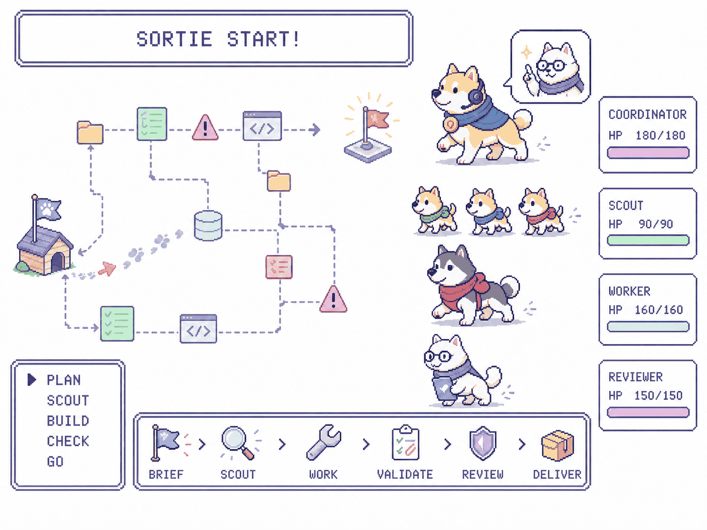
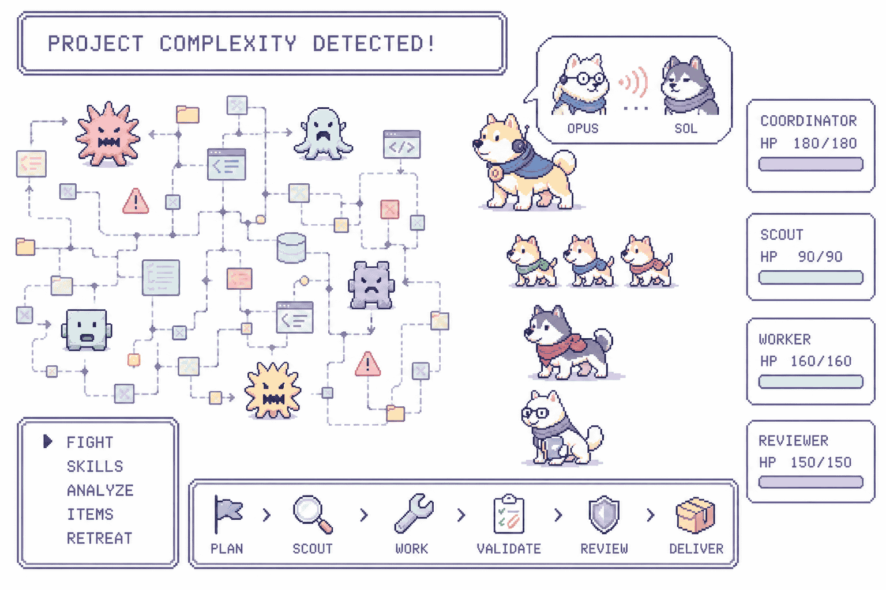
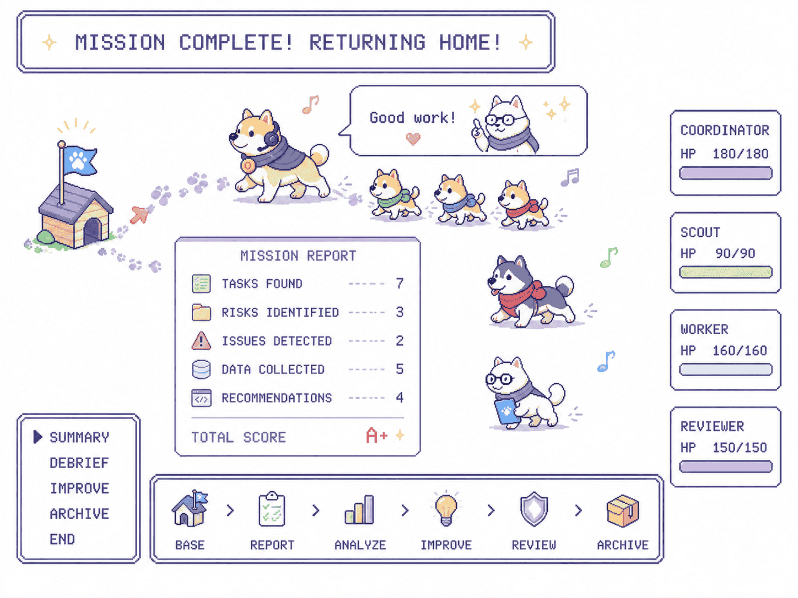

# Sortie-dogs 日本語ガイド

**OpenCode にタスクを渡すだけで、調査・実装・検証を境界付きのループとして進められる。**

[](assets/sortie-workflow.gif)

_画像を選択するとワークフローのアニメーションを再生できる。_

Sortie-dogs は、必要なセッションだけで動く OpenCode オーケストレーションプラグイン。
タスクを明確な計画、並列調査、専任実装、canonical validation、証拠付き完了へつなげる。
OpenCode 標準のエージェントや設定は置き換えない。

要件: Node.js 22.6 以降、npm、OpenCode。

[English README](../README.md) · [简体中文](guide-zh-CN.md)

## Sortie-dogs の利点

- **必要なときだけ起動** — `/sortie` または `dog-coordinator` 選択時だけ有効。他の
  OpenCode セッションには影響しない。
- **過剰に広がらない並列調査** — 各 worker handoff の前に境界付き scout を必ず3体だけ使う。
- **厳密な変更範囲** — source manifest または operation manifest が編集と handoff を制限。
- **実装責任を一本化** — 専用 Sol worker が implementation、remediation、
  blocker-resolution を担当。
- **証拠を伴う完了** — canonical validation、リスク別レビュー、terminal evidence の gate 後、
  coordinator だけが完了と commit を管理。
- **中断から継続可能** — restart recovery と境界付き compaction が handoff context を保持。

## 実際のループ

1. **Brief / plan** — `dog-coordinator` が acceptance criteria、変更 manifest、検証条件を確定。
2. **3体の scout** — read-only の限定調査を並列実行し、異なる観点の evidence を収集。
3. **専用 worker** — 承認済み manifest 内だけを実装。範囲内の修正と blocker 解消も担当。
4. **Canonical validation** — 指定された test / build command の結果を evidence 化。
5. **リスク別 review** — 高リスク候補だけ独立 review。低リスク候補は validation 後に省略可能。
6. **Coordinator 完了** — manifest、validation、review、evidence gate 通過後だけ完了と commit を管理。
7. **境界付き継続** — restart recovery と compaction handoff で進捗を引き継ぎ、batch の無制限化を防止。

## 実行例

低リスクの実行例では、各 gate を示しながら境界内で完了する。

```text
利用者: /sortie 要求された動作を追加する
dog-coordinator: manifest 確定
dog-scout ×3: 調査完了
dog-worker: 実装完了
validation: npm test — PASS
review: 省略 — 低リスク
dog-coordinator: 完了 evidence 承認
```

## 画面で見る流れ

### 複雑さを抑える



Coordinator が調査、実装、validation、review を別々の role に分ける。Project が複雑でも、
manifest gate が各 role の write scope を限定する。

### 証拠付きで完了する



Canonical validation とリスク別 review を通過してから coordinator が完了を確定する。
変更内容と確認方法を示す簡潔な evidence を伴ってタスクを返す。

## npm からインストール

対象プロジェクトで公開 npm package を依存関係へ追加し、project-local な OpenCode runtime
file を生成する。

```sh
npm install --save-dev sortie-dogs
npx sortie-dogs init .
```

または CLI をグローバルインストールし、対象プロジェクトを初期化する。

```sh
npm install --global sortie-dogs
sortie-dogs init .
```

グローバルインストールで `sortie-dogs` CLI が利用可能になる。`sortie-dogs init .` が
書き込む OpenCode runtime file は引き続き対象プロジェクト内に置かれる。npm package の
グローバルインストールだけでは対象プロジェクトは有効化されない。以下の project-local 設定と
plugin bridge の作成も行う。

`dog-coordinator` と `dog-scout` のデフォルト model は `openai/gpt-5.6-luna`。両 role で
別の model を使う場合、次を `.opencode/sortie-dogs.json` に保存する。

```json
{
  "modelRouting": {
    "dog-coordinator": {
      "preferred": { "model": "provider/model" }
    },
    "dog-scout": {
      "preferred": { "model": "provider/model" }
    }
  },
  "modelCatalog": {
    "project": [{ "model": "provider/model" }]
  }
}
```

`provider/model` は利用可能な model に置き換える。次に OpenCode 用ブリッジ
`.opencode/plugins/sortie-dogs.ts` を作成する。

```ts
export { SortieDogsPlugin } from "sortie-dogs/plugin";
```

OpenCode が自動検出するため、`opencode.json` の `plugin` 設定は不要。OpenCode 再起動後に開始する。

```text
/sortie <タスク>
```

`dog-coordinator` を直接選択しても起動できる。

## Write gate

Write gate は project ごとの opt-in。project root に `operation-manifest.json` が無い間、
plugin は passive でありツール呼び出しを一切拒否しない。この file を作ることが opt-in であり、
だから coordinator はいつでもこの file を作成できる。

```json
{
  "version": "0.1.0",
  "task_id": "add-requested-behavior",
  "read": ["src/feature.ts", "test/feature.test.ts"],
  "write": ["src/feature.ts", "test/feature.test.ts"],
  "validation": ["npm test"]
}
```

- `write`: bind 済み worker が変更できる唯一の path 集合。directory 指定は配下を含み、
  それ以外は exact path。
- `validation`: bind 済み worker が実行できる exact command。build / test command は path 抽出で
  分類できないため、宣言と完全一致した command だけを許可し、それ以外は unclassified として拒否する。
- `read`: 読み取り範囲の記録。read は拒否しない。

この file は `dog-coordinator` が所有する。worker は candidate ごとに一度だけ
`sortie_bind_write_gate` で bind し、bind は coordinator の handoff 検査後にのみ成立する。
coordinator session は gate 対象外。

`.opencode/sortie-dogs.json` の任意設定:

```json
{
  "operationManifestPath": "operation-manifest.json",
  "handoffPaths": ["handoff.json"],
  "readOnlyTools": ["my_mcp_search"],
  "dedicatedWorkerModel": { "model": "provider/model", "variant": "deep" }
}
```

- `operationManifestPath`: manifest の位置。project 相対。
- `handoffPaths`: plugin が検査する handoff file。worker はこの検査を通過して初めて bind できる。
  空配列にすると bind 自体が成立しない。
- `readOnlyTools`: MCP tool など、file を変更しない host 固有 tool 名を追加する。
  未知の tool は bind 済み session では既定で拒否される。
- `dedicatedWorkerModel`: 全 worker role が解決する単一 model。既定は `openai/gpt-5.6-sol` /
  variant `xhigh`。この model を使えない環境では自分の model を宣言する。worker role は常に
  この単一 target に解決され、role ごとの routing はできない。

## セッション lifecycle

プラグインは通常時 passive。`/sortie` を使うか `dog-coordinator` を選択したセッションだけを
有効化する。Source / operation manifest の exact write scope と worker handoff を検証し、
範囲外変更を通さない。標準 OpenCode agent、role、setting、無関係な session は維持される。

`session.idle` で最終 handoff を検証して session を解放し、`session.deleted` でも解放する。
後続 request では再度有効化が必要。

## モデルルーティング

`dog-coordinator` と `dog-scout` のデフォルトは `openai/gpt-5.6-luna` の `xhigh`
variant。この構成を推奨する。境界付き prompt、簡潔な scout evidence、不要な context / tool turn
の削減により、品質維持に配慮しつつ token 使用量を抑えられる可能性がある。Project-local routing
で両 role のデフォルトを上書き可能。

`implementation`、`remediation`、`blocker-resolution`、`dog-advisor` は専用 Sol の
`xhigh` に固定され、ユーザー設定では置換できない。その他の明示 route は Preferred target から順序付き fallback
へ決定的に解決する。以下の `dog-advisor` は built-in の固定 route 表示であり、ユーザー設定では上書きできない。Built-in default も明示 route もない role は、OpenCode で選択済みの model
を維持する。

```json
{
  "modelRouting": {
    "dog-coordinator": {
      "preferred": { "model": "openai/gpt-5.6-luna", "variant": "xhigh" }
    },
    "dog-scout": {
      "preferred": { "model": "openai/gpt-5.6-luna", "variant": "xhigh" }
    },
    "dog-advisor": {
      "preferred": { "model": "openai/gpt-5.6-sol", "variant": "xhigh" }
    },
    "dog-reviewer": {
      "preferred": { "model": "fable/opus", "variant": "thinking" },
      "fallback": [{ "model": "provider/general" }]
    }
  },
  "modelCatalog": {
    "project": [
      { "model": "openai/gpt-5.6-sol", "variants": ["xhigh"] },
      { "model": "openai/gpt-5.6-luna", "variants": ["xhigh"] },
      { "model": "fable/opus", "variants": ["thinking"] },
      { "model": "provider/general" }
    ]
  }
}
```

設定先は `.opencode/sortie-dogs.json`。`modelCatalog` には実在する provider model と named
variant だけを宣言する。Sortie-dogs は variant を推測、probe、変換しない。Preferred、fallback
の順で解決し、明示 route の候補が catalog に一つもなければ拒否する。advisor route は固定、
reviewer route は任意の secondary example。

`dog-advisor` は coordinator からの限定 Strategy / SourceReview 相談専用。
`dog-reviewer` は canonical validation 後、高リスク候補だけを独立 review する。どちらも実装、
stage、commit、ユーザー対応を行わない。

## 更新と移行

依存 asset を新しい release に更新後、対象 project root で再実行する。

```sh
npx sortie-dogs init .
```

`init` は冪等。Sortie-dogs 所有 file を更新し、認識済み旧 runtime file を移行して、version を
`.opencode/sortie-dogs.version` に記録する。競合または未認識 file は変更せず安全に停止する。
`.opencode/sortie-dogs.json` を含むユーザー所有設定と OpenCode 標準 file は維持される。

## 安全な手動削除

Sortie-dogs にサポート対象の uninstall command はない。npm dependency は別途削除し、生成
runtime file は[安全な手動削除ガイド](uninstall.md)に従って削除する。Sortie-dogs 所有を確認した
exact path だけを対象とし、`.opencode` directory、wildcard、ユーザー所有 file は削除しない。
